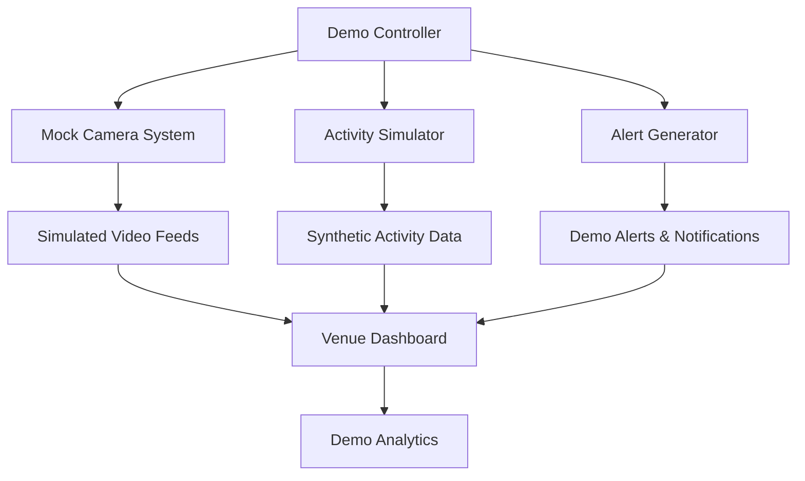

# Demo & Simulation System Overview

## Introduction

mySafePlay™(TM)'s Demo & Simulation System provides a comprehensive mock environment for demonstrating the platform's capabilities without requiring actual camera hardware or live venue operations. The system simulates real-time activities, generates demo alerts, and provides interactive venue management features.

## Table of Contents

1. [System Architecture](#system-architecture)
2. [Mock Camera Simulation](#mock-camera-simulation)
3. [Activity Simulation](#activity-simulation)
4. [Demo Alert System](#demo-alert-system)
5. [Venue Demo Features](#venue-demo-features)
6. [Configuration & Setup](#configuration--setup)
7. [API Reference](#api-reference)

## System Architecture

### Demo System Components



### Core Features

- **Mock Camera Simulation**: Simulated camera feeds with realistic activity
- **Real-time Activity Generation**: Synthetic child activities and movements
- **Demo Alert System**: Configurable alert scenarios
- **Interactive Dashboards**: Full venue management interface
- **Analytics Simulation**: Realistic usage metrics and reports
- **Stakeholder Demonstrations**: Professional demo environment

## Mock Camera Simulation

### Camera Feed Simulation

The system simulates multiple camera feeds with realistic activity patterns:

```typescript
// Mock camera configuration
interface MockCamera {
  id: string;
  name: string;
  location: {
    zone: string;
    coordinates: { x: number; y: number };
  };
  simulationSettings: {
    activityLevel: 'LOW' | 'MEDIUM' | 'HIGH';
    childCount: number;
    alertFrequency: number; // alerts per hour
    scenarios: DemoScenario[];
  };
}

// Demo scenario types
type DemoScenario = 
  | 'NORMAL_PLAY'
  | 'CROWDED_AREA'
  | 'CHILD_SEPARATION'
  | 'UNAUTHORIZED_AREA'
  | 'EMERGENCY_DRILL'
  | 'PICKUP_TIME';
```

### Camera Feed Implementation

```typescript
// Mock camera feed generator
class MockCameraFeed {
  private camera: MockCamera;
  private activityGenerator: ActivityGenerator;
  
  constructor(camera: MockCamera) {
    this.camera = camera;
    this.activityGenerator = new ActivityGenerator(camera.simulationSettings);
  }
  
  generateFrame(): CameraFrame {
    const activities = this.activityGenerator.generateActivities();
    const detectedChildren = this.simulateChildDetection(activities);
    
    return {
      cameraId: this.camera.id,
      timestamp: new Date(),
      detectedChildren,
      activities,
      metadata: {
        frameNumber: this.getFrameNumber(),
        processingTime: Math.random() * 50 + 10, // 10-60ms
        confidence: 0.85 + Math.random() * 0.1 // 85-95%
      }
    };
  }
  
  private simulateChildDetection(activities: Activity[]): DetectedChild[] {
    return activities.map(activity => ({
      childId: activity.childId,
      confidence: 0.9 + Math.random() * 0.1,
      boundingBox: this.generateBoundingBox(),
      pose: activity.pose,
      emotion: this.simulateEmotion(),
      lastSeen: new Date()
    }));
  }
}
```

### Camera Management Interface

```tsx
// Demo camera management component
export const DemoCameraManager: React.FC<{
  venueId: string;
}> = ({ venueId }) => {
  const [cameras, setCameras] = useState<MockCamera[]>([]);
  const [selectedCamera, setSelectedCamera] = useState<string | null>(null);
  
  const updateCameraSettings = async (cameraId: string, settings: Partial<MockCamera['simulationSettings']>) => {
    const response = await fetch(`/api/demo/cameras/${cameraId}/settings`, {
      method: 'PUT',
      headers: { 'Content-Type': 'application/json' },
      body: JSON.stringify(settings)
    });
    
    if (response.ok) {
      // Update local state
      setCameras(prev => prev.map(cam => 
        cam.id === cameraId 
          ? { ...cam, simulationSettings: { ...cam.simulationSettings, ...settings }}
          : cam
      ));
    }
  };
  
  return (
    <div className="demo-camera-manager">
      <div className="camera-grid">
        {cameras.map(camera => (
          <DemoCameraCard
            key={camera.id}
            camera={camera}
            isSelected={selectedCamera === camera.id}
            onSelect={() => setSelectedCamera(camera.id)}
            onUpdateSettings={(settings) => updateCameraSettings(camera.id, settings)}
          />
        ))}
      </div>
      
      {selectedCamera && (
        <DemoCameraControls
          camera={cameras.find(c => c.id === selectedCamera)!}
          onScenarioTrigger={(scenario) => triggerDemoScenario(selectedCamera, scenario)}
        />
      )}
    </div>
  );
};
```

## Activity Simulation

### Activity Generation

The system generates realistic child activities and movements:

```typescript
// Activity generator
class ActivityGenerator {
  private settings: MockCamera['simulationSettings'];
  private timePatterns: TimePattern[];
  
  constructor(settings: MockCamera['simulationSettings']) {
    this.settings = settings;
    this.timePatterns = this.loadTimePatterns();
  }
  
  generateActivities(): Activity[] {
    const currentHour = new Date().getHours();
    const pattern = this.getPatternForTime(currentHour);
    const baseActivityCount = this.calculateBaseActivityCount(pattern);
    
    const activities: Activity[] = [];
    
    for (let i = 0; i < baseActivityCount; i++) {
      activities.push(this.generateSingleActivity(pattern));
    }
    
    // Add scenario-specific activities
    if (this.shouldTriggerScenario()) {
      activities.push(...this.generateScenarioActivities());
    }
    
    return activities;
  }
  
  private generateSingleActivity(pattern: TimePattern): Activity {
    return {
      id: generateId(),
      childId: this.selectRandomChild(),
      type: this.selectActivityType(pattern),
      location: this.generateLocation(),
      pose: this.generatePose(),
      duration: this.generateDuration(),
      confidence: 0.8 + Math.random() * 0.2,
      timestamp: new Date()
    };
  }
  
  private selectActivityType(pattern: TimePattern): ActivityType {
    const weights = pattern.activityWeights;
    const random = Math.random();
    let cumulative = 0;
    
    for (const [type, weight] of Object.entries(weights)) {
      cumulative += weight;
      if (random <= cumulative) {
        return type as ActivityType;
      }
    }
    
    return 'PLAYING'; // Default
  }
}
```

### Activity Types

```typescript
// Supported activity types
enum ActivityType {
  PLAYING = 'PLAYING',
  WALKING = 'WALKING',
  RUNNING = 'RUNNING',
  SITTING = 'SITTING',
  STANDING = 'STANDING',
  INTERACTING = 'INTERACTING',
  EATING = 'EATING',
  SLEEPING = 'SLEEPING',
  CRYING = 'CRYING',
  CLIMBING = 'CLIMBING'
}

// Activity patterns by time of day
interface TimePattern {
  timeRange: { start: number; end: number };
  activityLevel: number; // 0-1
  activityWeights: Record<ActivityType, number>;
  alertProbability: number;
}

const timePatterns: TimePattern[] = [
  {
    timeRange: { start: 9, end: 11 }, // Morning arrival
    activityLevel: 0.8,
    activityWeights: {
      PLAYING: 0.4,
      WALKING: 0.3,
      INTERACTING: 0.2,
      STANDING: 0.1
    },
    alertProbability: 0.1
  },
  {
    timeRange: { start: 12, end: 13 }, // Lunch time
    activityLevel: 0.6,
    activityWeights: {
      EATING: 0.5,
      SITTING: 0.3,
      WALKING: 0.2
    },
    alertProbability: 0.05
  }
  // ... more patterns
];
```

## Demo Alert System

### Alert Generation

The demo system generates realistic alerts based on simulated activities:

```typescript
// Demo alert generator
class DemoAlertGenerator {
  private alertScenarios: AlertScenario[];
  
  constructor() {
    this.alertScenarios = this.loadAlertScenarios();
  }
  
  generateAlert(trigger: AlertTrigger): DemoAlert | null {
    const scenario = this.selectScenario(trigger);
    if (!scenario) return null;
    
    return {
      id: generateId(),
      type: scenario.type,
      severity: scenario.severity,
      title: scenario.title,
      description: this.generateDescription(scenario, trigger),
      location: trigger.location,
      childId: trigger.childId,
      cameraId: trigger.cameraId,
      timestamp: new Date(),
      isDemo: true,
      metadata: {
        scenario: scenario.name,
        confidence: scenario.confidence,
        autoResolve: scenario.autoResolve,
        resolveAfter: scenario.resolveAfter
      }
    };
  }
  
  private selectScenario(trigger: AlertTrigger): AlertScenario | null {
    const eligibleScenarios = this.alertScenarios.filter(scenario =>
      scenario.triggers.includes(trigger.type) &&
      Math.random() < scenario.probability
    );
    
    if (eligibleScenarios.length === 0) return null;
    
    // Select based on weighted probability
    return this.weightedRandomSelect(eligibleScenarios);
  }
}
```

### Alert Scenarios

```typescript
// Demo alert scenarios
interface AlertScenario {
  name: string;
  type: AlertType;
  severity: AlertSeverity;
  title: string;
  description: string;
  triggers: AlertTriggerType[];
  probability: number; // 0-1
  confidence: number; // 0-1
  autoResolve: boolean;
  resolveAfter?: number; // minutes
  requiredActions?: string[];
}

const demoAlertScenarios: AlertScenario[] = [
  {
    name: 'Child Separation',
    type: 'CHILD_SEPARATION',
    severity: 'HIGH',
    title: 'Child Separated from Group',
    description: 'Child has moved away from their designated group area',
    triggers: ['LOCATION_CHANGE', 'GROUP_SEPARATION'],
    probability: 0.15,
    confidence: 0.92,
    autoResolve: true,
    resolveAfter: 5,
    requiredActions: ['LOCATE_CHILD', 'NOTIFY_GUARDIAN']
  },
  {
    name: 'Unauthorized Area Access',
    type: 'UNAUTHORIZED_ACCESS',
    severity: 'MEDIUM',
    title: 'Child in Restricted Area',
    description: 'Child has entered an area marked as off-limits',
    triggers: ['ZONE_VIOLATION'],
    probability: 0.08,
    confidence: 0.88,
    autoResolve: false,
    requiredActions: ['GUIDE_CHILD_OUT', 'CHECK_AREA_SECURITY']
  },
  {
    name: 'Unusual Behavior',
    type: 'BEHAVIOR_ANOMALY',
    severity: 'LOW',
    title: 'Unusual Activity Detected',
    description: 'Child behavior pattern differs from normal activity',
    triggers: ['BEHAVIOR_CHANGE'],
    probability: 0.05,
    confidence: 0.75,
    autoResolve: true,
    resolveAfter: 10
  }
];
```

### Alert Management Interface

```tsx
// Demo alert management component
export const DemoAlertManager: React.FC<{
  venueId: string;
}> = ({ venueId }) => {
  const [alerts, setAlerts] = useState<DemoAlert[]>([]);
  const [alertSettings, setAlertSettings] = useState<DemoAlertSettings>();
  
  const triggerManualAlert = async (scenario: AlertScenario, childId: string) => {
    const response = await fetch('/api/demo/alerts/trigger', {
      method: 'POST',
      headers: { 'Content-Type': 'application/json' },
      body: JSON.stringify({
        venueId,
        scenario: scenario.name,
        childId,
        timestamp: new Date()
      })
    });
    
    if (response.ok) {
      const newAlert = await response.json();
      setAlerts(prev => [newAlert, ...prev]);
    }
  };
  
  const resolveAlert = async (alertId: string, resolution: string) => {
    const response = await fetch(`/api/demo/alerts/${alertId}/resolve`, {
      method: 'POST',
      headers: { 'Content-Type': 'application/json' },
      body: JSON.stringify({ resolution })
    });
    
    if (response.ok) {
      setAlerts(prev => prev.map(alert =>
        alert.id === alertId
          ? { ...alert, status: 'RESOLVED', resolvedAt: new Date(), resolution }
          : alert
      ));
    }
  };
  
  return (
    <div className="demo-alert-manager">
      <div className="alert-controls">
        <h3>Demo Alert Controls</h3>
        <div className="scenario-triggers">
          {demoAlertScenarios.map(scenario => (
            <button
              key={scenario.name}
              onClick={() => triggerManualAlert(scenario, 'demo-child-1')}
              className={`scenario-button severity-${scenario.severity.toLowerCase()}`}
            >
              Trigger {scenario.name}
            </button>
          ))}
        </div>
      </div>
      
      <div className="active-alerts">
        <h3>Active Demo Alerts</h3>
        {alerts.filter(alert => alert.status !== 'RESOLVED').map(alert => (
          <DemoAlertCard
            key={alert.id}
            alert={alert}
            onResolve={(resolution) => resolveAlert(alert.id, resolution)}
          />
        ))}
      </div>
    </div>
  );
};
```

## Venue Demo Features

### Demo Dashboard

The venue demo dashboard provides a comprehensive view of simulated venue operations:

```tsx
// Demo venue dashboard
export const DemoVenueDashboard: React.FC<{
  venueId: string;
}> = ({ venueId }) => {
  const [demoData, setDemoData] = useState<DemoVenueData>();
  const [isSimulationRunning, setIsSimulationRunning] = useState(false);
  
  const startSimulation = async () => {
    const response = await fetch(`/api/demo/venues/${venueId}/start`, {
      method: 'POST'
    });
    
    if (response.ok) {
      setIsSimulationRunning(true);
      // Start real-time updates
      startRealtimeUpdates();
    }
  };
  
  const stopSimulation = async () => {
    const response = await fetch(`/api/demo/venues/${venueId}/stop`, {
      method: 'POST'
    });
    
    if (response.ok) {
      setIsSimulationRunning(false);
      stopRealtimeUpdates();
    }
  };
  
  return (
    <div className="demo-venue-dashboard">
      <div className="demo-controls">
        <h2>Demo Venue: {demoData?.venue.name}</h2>
        <div className="simulation-controls">
          {!isSimulationRunning ? (
            <button onClick={startSimulation} className="start-button">
              Start Demo Simulation
            </button>
          ) : (
            <button onClick={stopSimulation} className="stop-button">
              Stop Simulation
            </button>
          )}
        </div>
      </div>
      
      <div className="demo-metrics">
        <DemoMetricsGrid metrics={demoData?.metrics} />
      </div>
      
      <div className="demo-zones">
        <DemoZoneMap
          zones={demoData?.zones}
          activities={demoData?.currentActivities}
          alerts={demoData?.activeAlerts}
        />
      </div>
      
      <div className="demo-timeline">
        <DemoActivityTimeline
          activities={demoData?.recentActivities}
          onActivitySelect={(activity) => highlightActivity(activity)}
        />
      </div>
    </div>
  );
};
```

### Interactive Zone Map

```tsx
// Demo zone map with interactive features
export const DemoZoneMap: React.FC<{
  zones: Zone[];
  activities: Activity[];
  alerts: DemoAlert[];
}> = ({ zones, activities, alerts }) => {
  const [selectedZone, setSelectedZone] = useState<string | null>(null);
  const [heatmapMode, setHeatmapMode] = useState(false);
  
  const renderZone = (zone: Zone) => {
    const zoneActivities = activities.filter(a => a.location.zoneId === zone.id);
    const zoneAlerts = alerts.filter(a => a.location?.zoneId === zone.id);
    
    return (
      <div
        key={zone.id}
        className={`demo-zone ${selectedZone === zone.id ? 'selected' : ''}`}
        style={{
          left: zone.coordinates.x,
          top: zone.coordinates.y,
          width: zone.dimensions.width,
          height: zone.dimensions.height
        }}
        onClick={() => setSelectedZone(zone.id)}
      >
        <div className="zone-label">{zone.name}</div>
        <div className="zone-stats">
          <span className="activity-count">{zoneActivities.length}</span>
          {zoneAlerts.length > 0 && (
            <span className="alert-indicator">{zoneAlerts.length}</span>
          )}
        </div>
        
        {/* Render activities as dots */}
        {zoneActivities.map(activity => (
          <div
            key={activity.id}
            className={`activity-dot ${activity.type.toLowerCase()}`}
            style={{
              left: activity.location.coordinates.x,
              top: activity.location.coordinates.y
            }}
            title={`${activity.type} - Child ${activity.childId}`}
          />
        ))}
        
        {/* Render alerts */}
        {zoneAlerts.map(alert => (
          <div
            key={alert.id}
            className={`alert-marker severity-${alert.severity.toLowerCase()}`}
            style={{
              left: alert.location?.coordinates.x,
              top: alert.location?.coordinates.y
            }}
            title={alert.title}
          />
        ))}
      </div>
    );
  };
  
  return (
    <div className="demo-zone-map">
      <div className="map-controls">
        <button
          onClick={() => setHeatmapMode(!heatmapMode)}
          className={heatmapMode ? 'active' : ''}
        >
          Heatmap View
        </button>
      </div>
      
      <div className={`map-container ${heatmapMode ? 'heatmap-mode' : ''}`}>
        {zones.map(renderZone)}
        
        {heatmapMode && (
          <DemoHeatmapOverlay activities={activities} />
        )}
      </div>
      
      {selectedZone && (
        <DemoZoneDetails
          zone={zones.find(z => z.id === selectedZone)!}
          activities={activities.filter(a => a.location.zoneId === selectedZone)}
          onClose={() => setSelectedZone(null)}
        />
      )}
    </div>
  );
};
```

## Configuration & Setup

### Demo Environment Setup

```typescript
// Demo configuration
interface DemoConfig {
  venue: {
    id: string;
    name: string;
    type: 'DAYCARE' | 'SCHOOL' | 'PLAYGROUND' | 'CAMP';
    capacity: number;
    zones: Zone[];
  };
  simulation: {
    childCount: number;
    staffCount: number;
    simulationSpeed: number; // 1x = real-time
    autoGenerateEvents: boolean;
    eventFrequency: number; // events per hour
  };
  cameras: MockCamera[];
  scenarios: AlertScenario[];
}

// Initialize demo environment
const initializeDemoEnvironment = async (config: DemoConfig) => {
  // Create demo venue
  const venue = await createDemoVenue(config.venue);
  
  // Set up mock cameras
  const cameras = await setupMockCameras(config.cameras, venue.id);
  
  // Initialize activity generators
  const activityGenerators = cameras.map(camera => 
    new ActivityGenerator(camera.simulationSettings)
  );
  
  // Start simulation
  const simulation = new DemoSimulation({
    venue,
    cameras,
    activityGenerators,
    config: config.simulation
  });
  
  await simulation.start();
  
  return { venue, simulation };
};
```

### Demo Data Generation

```typescript
// Generate realistic demo data
class DemoDataGenerator {
  generateChildren(count: number): DemoChild[] {
    return Array.from({ length: count }, (_, i) => ({
      id: `demo-child-${i + 1}`,
      firstName: this.generateFirstName(),
      lastName: this.generateLastName(),
      age: Math.floor(Math.random() * 10) + 3, // 3-12 years old
      profilePhoto: this.generateProfilePhoto(),
      guardianId: `demo-guardian-${Math.floor(i / 2) + 1}`, // 2 children per guardian
      preferences: this.generateChildPreferences(),
      medicalInfo: this.generateMedicalInfo()
    }));
  }
  
  generateStaff(count: number): DemoStaff[] {
    return Array.from({ length: count }, (_, i) => ({
      id: `demo-staff-${i + 1}`,
      name: this.generateStaffName(),
      role: this.selectStaffRole(),
      shift: this.generateShift(),
      zones: this.assignZones()
    }));
  }
  
  generateHistoricalData(days: number): HistoricalData {
    const data: HistoricalData = {
      dailyAttendance: [],
      alertHistory: [],
      activitySummaries: []
    };
    
    for (let i = 0; i < days; i++) {
      const date = new Date();
      date.setDate(date.getDate() - i);
      
      data.dailyAttendance.push(this.generateDailyAttendance(date));
      data.alertHistory.push(...this.generateDailyAlerts(date));
      data.activitySummaries.push(this.generateActivitySummary(date));
    }
    
    return data;
  }
}
```

## API Reference

### Demo Management Endpoints

| Endpoint | Method | Description |
|----------|--------|-------------|
| `/api/demo/venues/{id}/start` | POST | Start venue simulation |
| `/api/demo/venues/{id}/stop` | POST | Stop venue simulation |
| `/api/demo/venues/{id}/status` | GET | Get simulation status |
| `/api/demo/venues/{id}/config` | GET/PUT | Get/update demo configuration |

### Camera Simulation Endpoints

| Endpoint | Method | Description |
|----------|--------|-------------|
| `/api/demo/cameras` | GET | List demo cameras |
| `/api/demo/cameras/{id}/settings` | PUT | Update camera settings |
| `/api/demo/cameras/{id}/feed` | GET | Get simulated camera feed |
| `/api/demo/cameras/{id}/scenarios` | POST | Trigger camera scenario |

### Alert Simulation Endpoints

| Endpoint | Method | Description |
|----------|--------|-------------|
| `/api/demo/alerts/trigger` | POST | Manually trigger demo alert |
| `/api/demo/alerts/{id}/resolve` | POST | Resolve demo alert |
| `/api/demo/alerts/scenarios` | GET | List available alert scenarios |
| `/api/demo/alerts/history` | GET | Get demo alert history |

### Analytics Endpoints

| Endpoint | Method | Description |
|----------|--------|-------------|
| `/api/demo/analytics/realtime` | GET | Get real-time demo metrics |
| `/api/demo/analytics/historical` | GET | Get historical demo data |
| `/api/demo/analytics/export` | POST | Export demo analytics |

---

*The Demo & Simulation System provides a powerful way to showcase mySafePlay™(TM)'s capabilities in a controlled environment. For setup instructions and advanced configuration, see the configuration documentation.*
