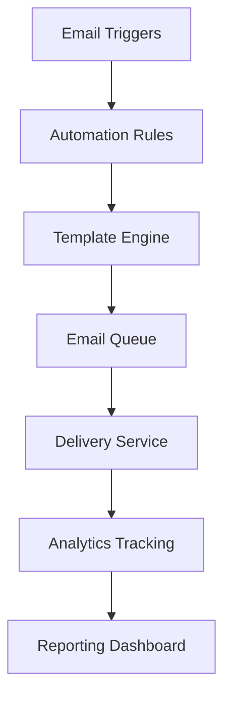

# Email Automation System

## Overview

mySafePlay™(TM)'s Email Automation System provides comprehensive automated email campaigns, including onboarding sequences, weekly safety tips, and custom automation workflows. The system features template management, queue processing, analytics tracking, and intelligent delivery optimization.

## Table of Contents

1. [System Architecture](#system-architecture)
2. [Email Campaigns](#email-campaigns)
3. [Automation Rules](#automation-rules)
4. [Template System](#template-system)
5. [Queue Management](#queue-management)
6. [Analytics & Tracking](#analytics--tracking)
7. [API Reference](#api-reference)
8. [Configuration](#configuration)

## System Architecture

### Core Components



### Database Models

The email automation system uses the following key models:

- **EmailTemplate**: Reusable email templates with Handlebars support
- **EmailCampaign**: Organized email campaigns with targeting
- **EmailAutomationRule**: Trigger-based automation workflows
- **EmailQueue**: Queued emails with scheduling and retry logic
- **EmailLog**: Delivery tracking and analytics
- **EmailSegment**: User segmentation for targeted campaigns

## Email Campaigns

### 1. Onboarding Email Sequence (7-Day)

Automated 7-day email sequence for new users:

| Day | Email Type | Subject | Trigger |
|-----|------------|---------|---------|
| 0 | Welcome | "Welcome to mySafePlay™(TM)!" | User registration |
| 1 | Setup Guide | "Complete Your mySafePlay™(TM) Setup" | 24 hours after registration |
| 2 | Safety Tips | "Essential Child Safety Tips" | 48 hours after registration |
| 3 | Feature Tour | "Discover mySafePlay™(TM) Features" | 72 hours after registration |
| 5 | Community | "Join the mySafePlay™(TM) Community" | 120 hours after registration |
| 7 | Feedback | "How's Your mySafePlay™(TM) Experience?" | 168 hours after registration |

#### Implementation Example

```typescript
// Onboarding sequence configuration
const onboardingSequence = {
  name: "7-Day Onboarding",
  trigger: "USER_REGISTRATION",
  emails: [
    {
      day: 0,
      templateId: "welcome-email",
      delay: 0
    },
    {
      day: 1,
      templateId: "setup-guide",
      delay: 1440 // 24 hours in minutes
    },
    {
      day: 2,
      templateId: "safety-tips",
      delay: 2880 // 48 hours in minutes
    }
    // ... additional emails
  ]
};
```

### 2. Weekly Safety Tips Campaign

Automated weekly safety tips sent to all active users:

```typescript
// Weekly campaign setup
const weeklySafetyTips = {
  name: "Weekly Safety Tips",
  schedule: "0 9 * * 1", // Every Monday at 9 AM
  segmentId: "active-users",
  templateId: "weekly-safety-tips",
  personalizeContent: true
};
```

### 3. Custom Campaigns

Create targeted campaigns for specific user segments:

```typescript
// Custom campaign example
const customCampaign = {
  name: "Venue Admin Training",
  targetSegment: "venue-admins",
  triggerConditions: {
    userRole: "VENUE_ADMIN",
    accountAge: { gte: 7 }, // 7 days old
    lastLogin: { gte: 3 } // Logged in within 3 days
  }
};
```

## Automation Rules

### Rule Types

#### 1. Trigger-Based Rules

```typescript
// User registration trigger
const registrationRule = {
  name: "Welcome Series",
  trigger: "USER_REGISTRATION",
  conditions: {
    userRole: ["PARENT", "GUARDIAN"],
    emailVerified: true
  },
  templateId: "welcome-series-parent",
  delay: 0
};

// Activity-based trigger
const inactivityRule = {
  name: "Re-engagement Campaign",
  trigger: "USER_INACTIVE",
  conditions: {
    lastLogin: { lte: 30 }, // 30 days ago
    accountStatus: "ACTIVE"
  },
  templateId: "re-engagement",
  delay: 0
};
```

#### 2. Scheduled Rules

```typescript
// Weekly newsletter
const weeklyNewsletter = {
  name: "Weekly Newsletter",
  trigger: "SCHEDULED",
  schedule: "0 10 * * 1", // Monday 10 AM
  segmentId: "newsletter-subscribers",
  templateId: "weekly-newsletter"
};
```

#### 3. Event-Based Rules

```typescript
// Child check-in notification
const checkInRule = {
  name: "Check-in Confirmation",
  trigger: "CHILD_CHECK_IN",
  conditions: {
    notificationPreferences: { checkIn: true }
  },
  templateId: "check-in-confirmation",
  delay: 5 // 5 minutes delay
};
```

### Rule Configuration

```typescript
// Complete automation rule setup
const createAutomationRule = async (ruleData: {
  name: string;
  trigger: EmailTrigger;
  templateId: string;
  conditions?: object;
  delay?: number;
  maxSends?: number;
  isActive?: boolean;
}) => {
  const response = await fetch('/api/email-automation/rules', {
    method: 'POST',
    headers: { 'Content-Type': 'application/json' },
    body: JSON.stringify(ruleData)
  });
  
  return response.json();
};
```

## Template System

### Handlebars Integration

mySafePlay™(TM) uses Handlebars for dynamic email templates:

```handlebars
<!-- Welcome email template -->
<h1>Welcome to mySafePlay™(TM), {{user.name}}!</h1>

<p>Hi {{user.name}},</p>

<p>Thank you for joining mySafePlay™(TM)! We're excited to help you keep your children safe.</p>

{{#if user.children}}
<h2>Your Children</h2>
<ul>
{{#each user.children}}
  <li>{{this.firstName}} {{this.lastName}} ({{this.age}} years old)</li>
{{/each}}
</ul>
{{/if}}

<div class="cta-section">
  <a href="{{baseUrl}}/dashboard" class="cta-button">
    Get Started
  </a>
</div>

<p>Best regards,<br>The mySafePlay™(TM) Team</p>
```

### Template Variables

Available variables in all templates:

```typescript
interface TemplateVariables {
  user: {
    id: string;
    name: string;
    email: string;
    role: string;
    children?: Child[];
    verificationLevel: string;
  };
  venue?: {
    id: string;
    name: string;
    address: string;
  };
  baseUrl: string;
  unsubscribeUrl: string;
  trackingPixelUrl: string;
  currentDate: string;
  customData?: Record<string, any>;
}
```

### Template Management

```typescript
// Create email template
const createTemplate = async (templateData: {
  name: string;
  subject: string;
  htmlContent: string;
  textContent?: string;
  category: string;
}) => {
  const response = await fetch('/api/email-automation/templates', {
    method: 'POST',
    headers: { 'Content-Type': 'application/json' },
    body: JSON.stringify(templateData)
  });
  
  return response.json();
};

// Update template
const updateTemplate = async (templateId: string, updates: Partial<EmailTemplate>) => {
  const response = await fetch(`/api/email-automation/templates/${templateId}`, {
    method: 'PUT',
    headers: { 'Content-Type': 'application/json' },
    body: JSON.stringify(updates)
  });
  
  return response.json();
};
```

## Queue Management

### Queue Processing

The email queue processes emails with the following priorities:

1. **URGENT** - Immediate delivery (security alerts, emergencies)
2. **HIGH** - Within 5 minutes (check-in notifications, alerts)
3. **NORMAL** - Within 15 minutes (general notifications)
4. **LOW** - Within 1 hour (newsletters, marketing)

### Queue Configuration

```typescript
// Queue settings
const queueConfig = {
  maxRetries: 3,
  retryDelay: [5, 15, 60], // Minutes between retries
  batchSize: 100, // Emails processed per batch
  processingInterval: 60, // Seconds between processing cycles
  deadLetterQueue: true // Failed emails after max retries
};
```

### Queue Monitoring

```typescript
// Get queue status
const getQueueStatus = async () => {
  const response = await fetch('/api/email-automation/queue/status');
  return response.json();
};

// Queue status response
interface QueueStatus {
  pending: number;
  processing: number;
  completed: number;
  failed: number;
  retrying: number;
  averageProcessingTime: number; // seconds
  lastProcessedAt: string;
}
```

## Analytics & Tracking

### Email Metrics

Track comprehensive email performance:

```typescript
interface EmailMetrics {
  sent: number;
  delivered: number;
  opened: number;
  clicked: number;
  bounced: number;
  unsubscribed: number;
  complained: number;
  
  // Calculated rates
  deliveryRate: number;
  openRate: number;
  clickRate: number;
  bounceRate: number;
  unsubscribeRate: number;
}
```

### Tracking Implementation

```typescript
// Email open tracking
const trackEmailOpen = async (emailId: string, userId: string) => {
  await fetch('/api/email-tracking/open', {
    method: 'POST',
    headers: { 'Content-Type': 'application/json' },
    body: JSON.stringify({ emailId, userId })
  });
};

// Link click tracking
const trackEmailClick = async (emailId: string, userId: string, linkUrl: string) => {
  await fetch('/api/email-tracking/click', {
    method: 'POST',
    headers: { 'Content-Type': 'application/json' },
    body: JSON.stringify({ emailId, userId, linkUrl })
  });
};
```

### Campaign Analytics

```typescript
// Get campaign performance
const getCampaignAnalytics = async (campaignId: string, dateRange?: {
  startDate: string;
  endDate: string;
}) => {
  const params = new URLSearchParams();
  if (dateRange) {
    params.append('startDate', dateRange.startDate);
    params.append('endDate', dateRange.endDate);
  }
  
  const response = await fetch(`/api/email-automation/campaigns/${campaignId}/analytics?${params}`);
  return response.json();
};
```

## API Reference

### Campaign Management

| Endpoint | Method | Description |
|----------|--------|-------------|
| `/api/email-automation/campaigns` | GET | List all campaigns |
| `/api/email-automation/campaigns` | POST | Create new campaign |
| `/api/email-automation/campaigns/{id}` | GET | Get campaign details |
| `/api/email-automation/campaigns/{id}` | PUT | Update campaign |
| `/api/email-automation/campaigns/{id}` | DELETE | Delete campaign |

### Automation Rules

| Endpoint | Method | Description |
|----------|--------|-------------|
| `/api/email-automation/rules` | GET | List automation rules |
| `/api/email-automation/rules` | POST | Create automation rule |
| `/api/email-automation/rules/{id}` | PUT | Update rule |
| `/api/email-automation/rules/{id}` | DELETE | Delete rule |

### Templates

| Endpoint | Method | Description |
|----------|--------|-------------|
| `/api/email-automation/templates` | GET | List templates |
| `/api/email-automation/templates` | POST | Create template |
| `/api/email-automation/templates/{id}` | PUT | Update template |
| `/api/email-automation/templates/{id}` | DELETE | Delete template |

### Queue Management

| Endpoint | Method | Description |
|----------|--------|-------------|
| `/api/email-automation/queue` | GET | Get queue status |
| `/api/email-automation/queue/process` | POST | Trigger queue processing |
| `/api/email-automation/queue/retry/{id}` | POST | Retry failed email |

## Configuration

### Environment Variables

```bash
# Email Service Configuration
EMAIL_SERVICE_PROVIDER=sendgrid  # or 'ses', 'mailgun'
EMAIL_API_KEY=your_api_key
EMAIL_FROM_ADDRESS=noreply@mysafeplay.ai
EMAIL_FROM_NAME=mySafePlay™(TM)

# Queue Configuration
EMAIL_QUEUE_BATCH_SIZE=100
EMAIL_QUEUE_RETRY_ATTEMPTS=3
EMAIL_QUEUE_PROCESSING_INTERVAL=60

# Analytics
EMAIL_TRACKING_ENABLED=true
EMAIL_CLICK_TRACKING_DOMAIN=track.safeplay.com

# Rate Limiting
EMAIL_RATE_LIMIT_PER_HOUR=1000
EMAIL_RATE_LIMIT_PER_DAY=10000
```

### Service Setup

```typescript
// Email service initialization
import { EmailAutomationService } from '@/lib/email-automation';

const emailService = new EmailAutomationService({
  provider: process.env.EMAIL_SERVICE_PROVIDER,
  apiKey: process.env.EMAIL_API_KEY,
  fromAddress: process.env.EMAIL_FROM_ADDRESS,
  fromName: process.env.EMAIL_FROM_NAME,
  trackingEnabled: process.env.EMAIL_TRACKING_ENABLED === 'true'
});
```

### Deployment Checklist

- [ ] Configure email service provider credentials
- [ ] Set up tracking domain (CNAME record)
- [ ] Configure queue processing cron jobs
- [ ] Set up monitoring and alerting
- [ ] Test email delivery in staging environment
- [ ] Configure unsubscribe handling
- [ ] Set up bounce and complaint handling
- [ ] Configure rate limiting
- [ ] Test template rendering
- [ ] Verify analytics tracking

---

*For detailed implementation examples and troubleshooting, see the specific documentation sections for each component.*
