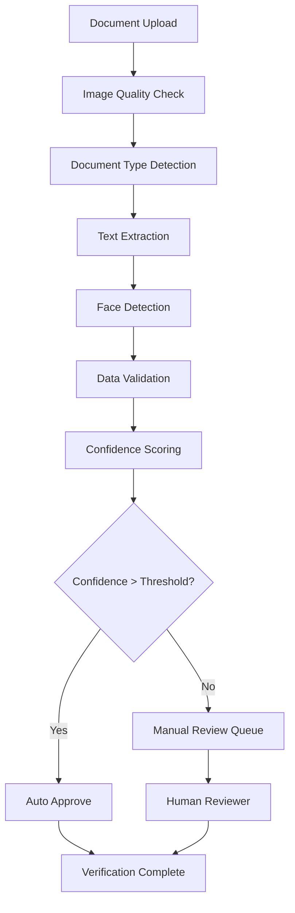

# AI-Powered Document Verification

## Overview

mySafePlay™(TM)'s document verification system uses AWS Rekognition and advanced AI algorithms to automatically verify identity documents, ensuring secure and reliable user verification. The system supports multiple document types and provides real-time verification with confidence scoring.

## Table of Contents

1. [Supported Documents](#supported-documents)
2. [AI Processing Pipeline](#ai-processing-pipeline)
3. [AWS Rekognition Integration](#aws-rekognition-integration)
4. [Verification Workflow](#verification-workflow)
5. [Security & Privacy](#security--privacy)
6. [API Reference](#api-reference)
7. [Troubleshooting](#troubleshooting)

## Supported Documents

### Document Types

| Document Type | Supported | AI Confidence Required | Manual Review Threshold |
|---------------|-----------|----------------------|------------------------|
| Driver's License |  | 85% | < 85% |
| Passport |  | 90% | < 90% |
| State ID |  | 85% | < 85% |
| Military ID |  | 80% | < 80% |
| Birth Certificate | * | N/A | Always Manual |
| Social Security Card |  | N/A | Not Accepted |

### Document Requirements

```typescript
interface DocumentRequirements {
  fileSize: {
    min: 100 * 1024;      // 100KB minimum
    max: 10 * 1024 * 1024; // 10MB maximum
  };
  formats: ['JPEG', 'PNG', 'PDF'];
  resolution: {
    min: { width: 800, height: 600 };
    recommended: { width: 1200, height: 900 };
  };
  quality: {
    brightness: { min: 30, max: 200 };
    contrast: { min: 0.5, max: 2.0 };
    sharpness: { min: 0.7 };
  };
}
```

## AI Processing Pipeline

### Document Analysis Flow



### AI Processing Service

```typescript
// lib/verification/ai-processor.ts
import { RekognitionClient, DetectTextCommand, DetectFacesCommand } from '@aws-sdk/client-rekognition';

export class DocumentAIProcessor {
  private rekognition: RekognitionClient;
  
  constructor() {
    this.rekognition = new RekognitionClient({
      region: process.env.AWS_REGION,
      credentials: {
        accessKeyId: process.env.AWS_ACCESS_KEY_ID!,
        secretAccessKey: process.env.AWS_SECRET_ACCESS_KEY!,
      },
    });
  }
  
  async processDocument(imageBuffer: Buffer, documentType: DocumentType): Promise<VerificationResult> {
    try {
      // Step 1: Image quality assessment
      const qualityCheck = await this.assessImageQuality(imageBuffer);
      if (!qualityCheck.acceptable) {
        return {
          success: false,
          error: 'Image quality insufficient',
          details: qualityCheck.issues
        };
      }
      
      // Step 2: Text extraction
      const textAnalysis = await this.extractText(imageBuffer);
      
      // Step 3: Face detection (for photo IDs)
      const faceAnalysis = await this.detectFaces(imageBuffer);
      
      // Step 4: Document-specific validation
      const validation = await this.validateDocument(textAnalysis, faceAnalysis, documentType);
      
      // Step 5: Calculate confidence score
      const confidence = this.calculateConfidence(textAnalysis, faceAnalysis, validation);
      
      return {
        success: true,
        confidence,
        extractedData: validation.extractedData,
        faceData: faceAnalysis,
        requiresManualReview: confidence < this.getThreshold(documentType),
        processingTime: Date.now() - startTime
      };
      
    } catch (error) {
      console.error('Document processing failed:', error);
      return {
        success: false,
        error: 'Processing failed',
        details: error.message
      };
    }
  }
  
  private async extractText(imageBuffer: Buffer): Promise<TextAnalysis> {
    const command = new DetectTextCommand({
      Image: { Bytes: imageBuffer }
    });
    
    const response = await this.rekognition.send(command);
    
    return {
      textDetections: response.TextDetections || [],
      extractedText: this.consolidateText(response.TextDetections || []),
      confidence: this.calculateTextConfidence(response.TextDetections || [])
    };
  }
  
  private async detectFaces(imageBuffer: Buffer): Promise<FaceAnalysis> {
    const command = new DetectFacesCommand({
      Image: { Bytes: imageBuffer },
      Attributes: ['ALL']
    });
    
    const response = await this.rekognition.send(command);
    
    return {
      faceCount: response.FaceDetails?.length || 0,
      faces: response.FaceDetails || [],
      primaryFace: this.selectPrimaryFace(response.FaceDetails || []),
      confidence: response.FaceDetails?.[0]?.Confidence || 0
    };
  }
  
  private async validateDocument(
    textAnalysis: TextAnalysis,
    faceAnalysis: FaceAnalysis,
    documentType: DocumentType
  ): Promise<DocumentValidation> {
    const validator = this.getValidatorForType(documentType);
    return await validator.validate(textAnalysis, faceAnalysis);
  }
  
  private calculateConfidence(
    textAnalysis: TextAnalysis,
    faceAnalysis: FaceAnalysis,
    validation: DocumentValidation
  ): number {
    const weights = {
      textQuality: 0.3,
      faceQuality: 0.2,
      dataValidation: 0.4,
      documentIntegrity: 0.1
    };
    
    const scores = {
      textQuality: textAnalysis.confidence / 100,
      faceQuality: faceAnalysis.confidence / 100,
      dataValidation: validation.dataScore / 100,
      documentIntegrity: validation.integrityScore / 100
    };
    
    return Object.entries(weights).reduce((total, [key, weight]) => {
      return total + (scores[key as keyof typeof scores] * weight);
    }, 0) * 100;
  }
}
```

### Document Type Validators

```typescript
// lib/verification/validators/drivers-license.ts
export class DriversLicenseValidator implements DocumentValidator {
  async validate(textAnalysis: TextAnalysis, faceAnalysis: FaceAnalysis): Promise<DocumentValidation> {
    const extractedData: any = {};
    const issues: string[] = [];
    
    // Extract standard fields
    const patterns = {
      licenseNumber: /(?:DL|LIC|LICENSE)\s*#?\s*([A-Z0-9]{8,15})/i,
      dateOfBirth: /(?:DOB|BIRTH)\s*:?\s*(\d{1,2}\/\d{1,2}\/\d{4})/i,
      expirationDate: /(?:EXP|EXPIRES)\s*:?\s*(\d{1,2}\/\d{1,2}\/\d{4})/i,
      name: /^([A-Z\s]+)$/m,
      address: /(\d+\s+[A-Z\s]+(?:ST|AVE|RD|BLVD|LN|DR))/i
    };
    
    // Extract data using patterns
    for (const [field, pattern] of Object.entries(patterns)) {
      const match = textAnalysis.extractedText.match(pattern);
      if (match) {
        extractedData[field] = match[1] || match[0];
      } else {
        issues.push(`Missing ${field}`);
      }
    }
    
    // Validate face presence
    if (faceAnalysis.faceCount === 0) {
      issues.push('No face detected');
    } else if (faceAnalysis.faceCount > 1) {
      issues.push('Multiple faces detected');
    }
    
    // Validate expiration date
    if (extractedData.expirationDate) {
      const expDate = new Date(extractedData.expirationDate);
      if (expDate < new Date()) {
        issues.push('Document expired');
      }
    }
    
    // Calculate validation scores
    const dataScore = ((Object.keys(extractedData).length / Object.keys(patterns).length) * 100);
    const integrityScore = Math.max(0, 100 - (issues.length * 20));
    
    return {
      extractedData,
      issues,
      dataScore,
      integrityScore,
      isValid: issues.length === 0
    };
  }
}

// lib/verification/validators/passport.ts
export class PassportValidator implements DocumentValidator {
  async validate(textAnalysis: TextAnalysis, faceAnalysis: FaceAnalysis): Promise<DocumentValidation> {
    const extractedData: any = {};
    const issues: string[] = [];
    
    // Passport-specific patterns
    const patterns = {
      passportNumber: /P<[A-Z]{3}([A-Z0-9]{9})/,
      nationality: /P<([A-Z]{3})/,
      surname: /P<[A-Z]{3}([A-Z<]+)<</,
      givenNames: /<<([A-Z<]+)/,
      dateOfBirth: /(\d{6})/,
      expirationDate: /(\d{6})/,
      sex: /[MF]/
    };
    
    // MRZ (Machine Readable Zone) validation
    const mrzLines = this.extractMRZLines(textAnalysis.extractedText);
    if (mrzLines.length < 2) {
      issues.push('Invalid or missing MRZ');
    } else {
      // Validate MRZ checksum
      if (!this.validateMRZChecksum(mrzLines)) {
        issues.push('MRZ checksum validation failed');
      }
    }
    
    // Extract and validate data
    for (const [field, pattern] of Object.entries(patterns)) {
      const match = textAnalysis.extractedText.match(pattern);
      if (match) {
        extractedData[field] = this.cleanMRZData(match[1] || match[0]);
      } else {
        issues.push(`Missing ${field}`);
      }
    }
    
    // Face validation for passport
    if (faceAnalysis.faceCount !== 1) {
      issues.push('Exactly one face required for passport');
    }
    
    const dataScore = ((Object.keys(extractedData).length / Object.keys(patterns).length) * 100);
    const integrityScore = Math.max(0, 100 - (issues.length * 15));
    
    return {
      extractedData,
      issues,
      dataScore,
      integrityScore,
      isValid: issues.length === 0
    };
  }
  
  private extractMRZLines(text: string): string[] {
    const lines = text.split('\n');
    return lines.filter(line => /^[A-Z0-9<]{30,}$/.test(line.trim()));
  }
  
  private validateMRZChecksum(mrzLines: string[]): boolean {
    // Implement MRZ checksum validation algorithm
    // This is a simplified version
    return true; // Placeholder
  }
  
  private cleanMRZData(data: string): string {
    return data.replace(/</g, ' ').trim();
  }
}
```

## AWS Rekognition Integration

### Service Configuration

```typescript
// lib/aws/rekognition-config.ts
export const rekognitionConfig = {
  region: process.env.AWS_REGION || 'us-east-1',
  credentials: {
    accessKeyId: process.env.AWS_ACCESS_KEY_ID!,
    secretAccessKey: process.env.AWS_SECRET_ACCESS_KEY!,
  },
  maxRetries: 3,
  retryDelayOptions: {
    base: 300 // 300ms base delay
  },
  httpOptions: {
    timeout: 30000 // 30 second timeout
  }
};

export const rekognitionLimits = {
  maxImageSize: 15 * 1024 * 1024, // 15MB
  supportedFormats: ['JPEG', 'PNG'],
  minImageDimensions: { width: 80, height: 80 },
  maxImageDimensions: { width: 4096, height: 4096 }
};
```

### Advanced Text Detection

```typescript
// lib/verification/text-detection.ts
export class AdvancedTextDetection {
  async detectAndAnalyzeText(imageBuffer: Buffer): Promise<EnhancedTextAnalysis> {
    const command = new DetectTextCommand({
      Image: { Bytes: imageBuffer },
      Filters: {
        WordFilter: {
          MinConfidence: 80,
          MinBoundingBoxHeight: 0.01,
          MinBoundingBoxWidth: 0.01
        }
      }
    });
    
    const response = await this.rekognition.send(command);
    const textDetections = response.TextDetections || [];
    
    // Group text by lines and words
    const lines = this.groupTextByLines(textDetections);
    const words = this.extractWords(textDetections);
    
    // Analyze text structure
    const structure = this.analyzeTextStructure(lines);
    
    // Extract potential data fields
    const dataFields = this.extractDataFields(lines);
    
    return {
      rawDetections: textDetections,
      lines,
      words,
      structure,
      dataFields,
      confidence: this.calculateOverallTextConfidence(textDetections)
    };
  }
  
  private groupTextByLines(detections: any[]): TextLine[] {
    const lines: TextLine[] = [];
    const lineDetections = detections.filter(d => d.Type === 'LINE');
    
    for (const detection of lineDetections) {
      lines.push({
        text: detection.DetectedText,
        confidence: detection.Confidence,
        boundingBox: detection.Geometry.BoundingBox,
        words: this.getWordsForLine(detection, detections)
      });
    }
    
    // Sort lines by vertical position
    return lines.sort((a, b) => a.boundingBox.Top - b.boundingBox.Top);
  }
  
  private extractDataFields(lines: TextLine[]): DataField[] {
    const fields: DataField[] = [];
    
    // Common document field patterns
    const fieldPatterns = [
      { name: 'name', pattern: /^(NAME|FULL NAME|LAST, FIRST):\s*(.+)$/i },
      { name: 'dateOfBirth', pattern: /^(DOB|DATE OF BIRTH|BIRTH DATE):\s*(.+)$/i },
      { name: 'address', pattern: /^(ADDRESS|ADDR):\s*(.+)$/i },
      { name: 'licenseNumber', pattern: /^(LICENSE|LIC|DL)\s*#?\s*(.+)$/i },
      { name: 'expirationDate', pattern: /^(EXP|EXPIRES|EXPIRATION):\s*(.+)$/i }
    ];
    
    for (const line of lines) {
      for (const pattern of fieldPatterns) {
        const match = line.text.match(pattern.pattern);
        if (match) {
          fields.push({
            name: pattern.name,
            value: match[2].trim(),
            confidence: line.confidence,
            source: 'pattern_match'
          });
        }
      }
    }
    
    return fields;
  }
}
```

### Face Analysis Enhancement

```typescript
// lib/verification/face-analysis.ts
export class DocumentFaceAnalysis {
  async analyzeFaceInDocument(imageBuffer: Buffer): Promise<DocumentFaceResult> {
    const command = new DetectFacesCommand({
      Image: { Bytes: imageBuffer },
      Attributes: [
        'ALL' // Get all face attributes
      ]
    });
    
    const response = await this.rekognition.send(command);
    const faces = response.FaceDetails || [];
    
    if (faces.length === 0) {
      return {
        success: false,
        error: 'No face detected in document',
        faceCount: 0
      };
    }
    
    if (faces.length > 1) {
      return {
        success: false,
        error: 'Multiple faces detected',
        faceCount: faces.length
      };
    }
    
    const primaryFace = faces[0];
    
    // Analyze face quality for document verification
    const qualityAnalysis = this.analyzeFaceQuality(primaryFace);
    
    return {
      success: true,
      faceCount: 1,
      primaryFace,
      qualityAnalysis,
      confidence: primaryFace.Confidence || 0,
      boundingBox: primaryFace.BoundingBox,
      landmarks: primaryFace.Landmarks,
      attributes: {
        ageRange: primaryFace.AgeRange,
        gender: primaryFace.Gender,
        emotions: primaryFace.Emotions,
        eyeglasses: primaryFace.Eyeglasses,
        sunglasses: primaryFace.Sunglasses,
        beard: primaryFace.Beard,
        mustache: primaryFace.Mustache
      }
    };
  }
  
  private analyzeFaceQuality(face: any): FaceQualityAnalysis {
    const quality = face.Quality || {};
    const pose = face.Pose || {};
    
    const issues: string[] = [];
    let overallScore = 100;
    
    // Check brightness
    if (quality.Brightness < 30 || quality.Brightness > 200) {
      issues.push('Poor lighting conditions');
      overallScore -= 20;
    }
    
    // Check sharpness
    if (quality.Sharpness < 70) {
      issues.push('Image not sharp enough');
      overallScore -= 15;
    }
    
    // Check pose angles
    if (Math.abs(pose.Yaw) > 15 || Math.abs(pose.Pitch) > 15 || Math.abs(pose.Roll) > 15) {
      issues.push('Face not properly aligned');
      overallScore -= 10;
    }
    
    // Check if eyes are open
    const leftEye = face.EyesOpen?.Value;
    const rightEye = face.EyesOpen?.Value;
    if (!leftEye || !rightEye) {
      issues.push('Eyes should be open and visible');
      overallScore -= 10;
    }
    
    return {
      score: Math.max(0, overallScore),
      issues,
      brightness: quality.Brightness,
      sharpness: quality.Sharpness,
      pose: {
        yaw: pose.Yaw,
        pitch: pose.Pitch,
        roll: pose.Roll
      },
      acceptable: overallScore >= 70
    };
  }
}
```

## Verification Workflow

### Complete Verification Process

```typescript
// lib/verification/verification-workflow.ts
export class DocumentVerificationWorkflow {
  async processVerificationRequest(request: VerificationRequest): Promise<VerificationResponse> {
    const startTime = Date.now();
    
    try {
      // Step 1: Validate request
      const validation = await this.validateRequest(request);
      if (!validation.valid) {
        return this.createErrorResponse(validation.errors);
      }
      
      // Step 2: Process document with AI
      const aiResult = await this.aiProcessor.processDocument(
        request.documentBuffer,
        request.documentType
      );
      
      // Step 3: Store verification attempt
      const verificationId = await this.storeVerificationAttempt({
        userId: request.userId,
        documentType: request.documentType,
        aiResult,
        status: aiResult.requiresManualReview ? 'PENDING_REVIEW' : 'COMPLETED'
      });
      
      // Step 4: Auto-approve or queue for manual review
      if (!aiResult.requiresManualReview && aiResult.confidence >= this.getAutoApprovalThreshold(request.documentType)) {
        await this.autoApproveVerification(verificationId, aiResult);
        
        return {
          success: true,
          verificationId,
          status: 'APPROVED',
          confidence: aiResult.confidence,
          processingTime: Date.now() - startTime,
          autoApproved: true
        };
      } else {
        await this.queueForManualReview(verificationId, aiResult);
        
        return {
          success: true,
          verificationId,
          status: 'PENDING_REVIEW',
          confidence: aiResult.confidence,
          processingTime: Date.now() - startTime,
          estimatedReviewTime: this.estimateReviewTime()
        };
      }
      
    } catch (error) {
      console.error('Verification workflow failed:', error);
      return this.createErrorResponse(['Processing failed: ' + error.message]);
    }
  }
  
  async handleManualReview(verificationId: string, reviewDecision: ReviewDecision): Promise<void> {
    const verification = await this.getVerification(verificationId);
    if (!verification) {
      throw new Error('Verification not found');
    }
    
    // Update verification status
    await this.updateVerificationStatus(verificationId, {
      status: reviewDecision.approved ? 'APPROVED' : 'REJECTED',
      reviewedBy: reviewDecision.reviewerId,
      reviewedAt: new Date(),
      reviewNotes: reviewDecision.notes,
      manualReview: true
    });
    
    // Update user verification level
    if (reviewDecision.approved) {
      await this.updateUserVerificationLevel(verification.userId, 'IDENTITY_VERIFIED');
    }
    
    // Send notification to user
    await this.notifyUser(verification.userId, {
      type: reviewDecision.approved ? 'VERIFICATION_APPROVED' : 'VERIFICATION_REJECTED',
      verificationId,
      message: reviewDecision.approved 
        ? 'Your identity verification has been approved'
        : `Your identity verification was rejected: ${reviewDecision.notes}`
    });
  }
  
  private async validateRequest(request: VerificationRequest): Promise<ValidationResult> {
    const errors: string[] = [];
    
    // Check file size
    if (request.documentBuffer.length > 10 * 1024 * 1024) {
      errors.push('File size too large (max 10MB)');
    }
    
    if (request.documentBuffer.length < 100 * 1024) {
      errors.push('File size too small (min 100KB)');
    }
    
    // Check document type
    if (!this.supportedDocumentTypes.includes(request.documentType)) {
      errors.push('Unsupported document type');
    }
    
    // Check user eligibility
    const user = await this.getUser(request.userId);
    if (!user) {
      errors.push('User not found');
    } else if (user.identityVerified) {
      errors.push('User already verified');
    }
    
    return {
      valid: errors.length === 0,
      errors
    };
  }
  
  private getAutoApprovalThreshold(documentType: DocumentType): number {
    const thresholds = {
      DRIVERS_LICENSE: 85,
      PASSPORT: 90,
      STATE_ID: 85,
      MILITARY_ID: 80
    };
    
    return thresholds[documentType] || 90;
  }
  
  private estimateReviewTime(): number {
    // Return estimated review time in hours based on queue length
    const queueLength = this.getManualReviewQueueLength();
    return Math.max(1, Math.ceil(queueLength / 10)); // Assume 10 reviews per hour
  }
}
```

## Security & Privacy

### Data Protection

```typescript
// lib/verification/data-protection.ts
export class VerificationDataProtection {
  async secureDocumentStorage(documentBuffer: Buffer, verificationId: string): Promise<string> {
    // Encrypt document before storage
    const encryptedBuffer = await this.encryptDocument(documentBuffer);
    
    // Store in secure S3 bucket with encryption
    const s3Key = `verifications/${verificationId}/document.encrypted`;
    await this.s3Service.uploadEncrypted(s3Key, encryptedBuffer, {
      ServerSideEncryption: 'aws:kms',
      SSEKMSKeyId: process.env.VERIFICATION_KMS_KEY_ID,
      Metadata: {
        'verification-id': verificationId,
        'encrypted': 'true',
        'retention-days': '90'
      }
    });
    
    return s3Key;
  }
  
  async scheduleDocumentDeletion(verificationId: string, retentionDays: number = 90): Promise<void> {
    const deleteAt = new Date();
    deleteAt.setDate(deleteAt.getDate() + retentionDays);
    
    await this.schedulerService.schedule({
      type: 'DELETE_VERIFICATION_DOCUMENT',
      executeAt: deleteAt,
      data: { verificationId }
    });
  }
  
  async anonymizeVerificationData(verificationId: string): Promise<void> {
    // Remove PII from verification record while keeping metadata for analytics
    await this.updateVerification(verificationId, {
      extractedData: null,
      documentUrl: null,
      aiResults: this.sanitizeAIResults(await this.getAIResults(verificationId)),
      anonymized: true,
      anonymizedAt: new Date()
    });
  }
  
  private async encryptDocument(buffer: Buffer): Promise<Buffer> {
    const algorithm = 'aes-256-gcm';
    const key = Buffer.from(process.env.DOCUMENT_ENCRYPTION_KEY!, 'hex');
    const iv = crypto.randomBytes(16);
    
    const cipher = crypto.createCipher(algorithm, key);
    cipher.setAAD(Buffer.from('verification-document'));
    
    const encrypted = Buffer.concat([
      cipher.update(buffer),
      cipher.final()
    ]);
    
    const authTag = cipher.getAuthTag();
    
    // Combine IV, auth tag, and encrypted data
    return Buffer.concat([iv, authTag, encrypted]);
  }
}
```

### Audit Trail

```typescript
// lib/verification/audit-trail.ts
export class VerificationAuditTrail {
  async logVerificationEvent(event: VerificationAuditEvent): Promise<void> {
    const auditEntry = {
      id: generateId(),
      verificationId: event.verificationId,
      userId: event.userId,
      eventType: event.type,
      timestamp: new Date(),
      ipAddress: event.ipAddress,
      userAgent: event.userAgent,
      details: event.details,
      sensitiveData: false // Never log sensitive data
    };
    
    await this.auditRepository.create(auditEntry);
    
    // Also log to external audit service for compliance
    if (process.env.EXTERNAL_AUDIT_ENABLED === 'true') {
      await this.externalAuditService.log(auditEntry);
    }
  }
  
  async getVerificationAuditTrail(verificationId: string): Promise<VerificationAuditEvent[]> {
    return await this.auditRepository.findByVerificationId(verificationId);
  }
  
  async generateComplianceReport(dateRange: DateRange): Promise<ComplianceReport> {
    const events = await this.auditRepository.findByDateRange(dateRange);
    
    return {
      totalVerifications: events.filter(e => e.eventType === 'VERIFICATION_STARTED').length,
      autoApproved: events.filter(e => e.eventType === 'AUTO_APPROVED').length,
      manuallyReviewed: events.filter(e => e.eventType === 'MANUAL_REVIEW_COMPLETED').length,
      rejected: events.filter(e => e.eventType === 'VERIFICATION_REJECTED').length,
      averageProcessingTime: this.calculateAverageProcessingTime(events),
      complianceScore: this.calculateComplianceScore(events)
    };
  }
}
```

## API Reference

### Document Upload Endpoints

| Endpoint | Method | Description |
|----------|--------|-------------|
| `/api/verification/document/upload` | POST | Upload document for verification |
| `/api/verification/status/{id}` | GET | Check verification status |
| `/api/verification/retry/{id}` | POST | Retry failed verification |
| `/api/verification/cancel/{id}` | POST | Cancel pending verification |

### Admin Endpoints

| Endpoint | Method | Description |
|----------|--------|-------------|
| `/api/admin/verification/pending` | GET | Get pending manual reviews |
| `/api/admin/verification/{id}/approve` | POST | Approve verification |
| `/api/admin/verification/{id}/reject` | POST | Reject verification |
| `/api/admin/verification/analytics` | GET | Get verification analytics |

## Troubleshooting

### Common Issues

#### 1. Low AI Confidence Scores

**Symptoms**: Documents consistently get low confidence scores
**Causes**:
- Poor image quality
- Unsupported document format
- Damaged or altered documents

**Solutions**:
```typescript
// Image quality improvement suggestions
const improvementSuggestions = {
  lowBrightness: 'Take photo in better lighting',
  lowSharpness: 'Ensure document is in focus',
  poorContrast: 'Avoid shadows and glare',
  wrongAngle: 'Take photo straight-on',
  tooSmall: 'Move closer to document'
};
```

#### 2. Text Extraction Failures

**Symptoms**: Important text not detected by OCR
**Causes**:
- Handwritten text
- Unusual fonts
- Poor image quality
- Document damage

**Solutions**:
```bash
# Test text extraction
node scripts/test-text-extraction.js --image="path/to/image.jpg"

# Adjust OCR settings
export REKOGNITION_MIN_CONFIDENCE=70
export REKOGNITION_WORD_FILTER_HEIGHT=0.005
```

#### 3. Face Detection Issues

**Symptoms**: Faces not detected in photo IDs
**Causes**:
- Poor lighting
- Face partially obscured
- Low resolution
- Wrong document orientation

**Solutions**:
```typescript
// Face detection debugging
const debugFaceDetection = async (imageBuffer: Buffer) => {
  const result = await rekognition.detectFaces({
    Image: { Bytes: imageBuffer },
    Attributes: ['ALL']
  });
  
  console.log('Face detection results:', {
    faceCount: result.FaceDetails?.length || 0,
    confidence: result.FaceDetails?.[0]?.Confidence,
    quality: result.FaceDetails?.[0]?.Quality
  });
};
```

### Performance Optimization

```typescript
// Optimize image processing
export const optimizeImageForProcessing = async (buffer: Buffer): Promise<Buffer> => {
  const image = sharp(buffer);
  const metadata = await image.metadata();
  
  // Resize if too large
  if (metadata.width! > 2048 || metadata.height! > 2048) {
    image.resize(2048, 2048, { fit: 'inside', withoutEnlargement: true });
  }
  
  // Enhance for OCR
  image
    .normalize() // Normalize contrast
    .sharpen()   // Enhance sharpness
    .jpeg({ quality: 95 }); // High quality JPEG
  
  return await image.toBuffer();
};
```

---

*For additional configuration and advanced features, refer to the AWS Rekognition documentation and the main authentication system documentation.*
