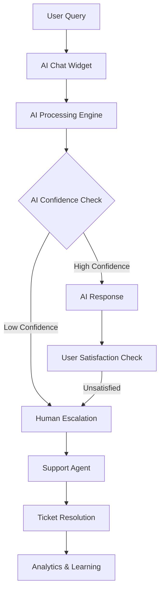
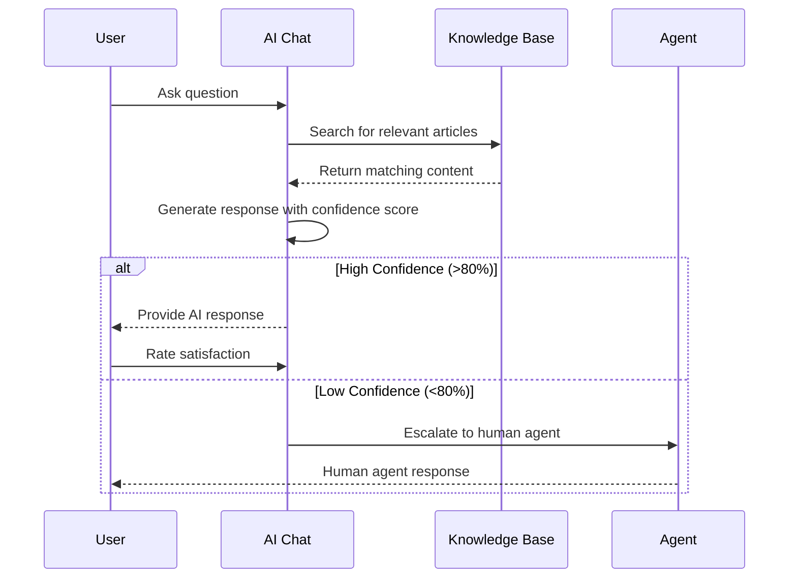

# AI-First Support Center Overview

## Introduction

mySafePlay™(TM)'s AI-First Support Center is a comprehensive customer support system that combines artificial intelligence with human expertise to provide exceptional support experiences. The system features an intelligent chatbot, comprehensive ticketing system, searchable knowledge base, and advanced analytics.

## Table of Contents

1. [System Architecture](#system-architecture)
2. [Core Components](#core-components)
3. [AI Integration](#ai-integration)
4. [User Experience Flow](#user-experience-flow)
5. [Admin Dashboard](#admin-dashboard)
6. [Performance Metrics](#performance-metrics)
7. [Integration Points](#integration-points)

## System Architecture

### High-Level Architecture



### Core Database Models

The support system is built on 11 comprehensive database models:

1. **SupportTicket** - Main ticket entity with AI processing fields
2. **SupportTicketMessage** - Messages within tickets
3. **SupportTicketTimeline** - Audit trail of ticket events
4. **TicketEscalation** - Escalation tracking and management
5. **SupportAgent** - Agent profiles and performance metrics
6. **KnowledgeBaseArticle** - Searchable help articles
7. **ArticleFeedback** - User feedback on articles
8. **SupportChatSession** - Real-time chat sessions
9. **ChatMessage** - Individual chat messages
10. **SupportWorkflow** - Automated workflow definitions
11. **SupportAnalytics** - Performance metrics and reporting

## Core Components

### 1. AI Chat Widget

The AI chat widget is the primary entry point for user support:

```typescript
// AI Chat Widget Implementation
import { AIChatWidget } from '@/components/support/ai-chat-widget';

<AIChatWidget
  userId={user.id}
  context={{
    page: 'dashboard',
    venueId: venue?.id,
    userRole: user.role
  }}
  onEscalation={(ticketId) => handleEscalation(ticketId)}
  onSatisfactionRating={(rating) => handleRating(rating)}
/>
```

#### Features:
- **Context-Aware Responses**: Understands current page and user context
- **Multi-turn Conversations**: Maintains conversation history
- **Smart Escalation**: Automatically escalates when AI confidence is low
- **Typing Indicators**: Real-time typing feedback
- **File Attachments**: Support for image and document uploads
- **Satisfaction Ratings**: Post-conversation feedback collection

### 2. Ticketing System

Comprehensive ticket management with AI enhancement:

```typescript
// Create support ticket
const createTicket = async (ticketData: {
  title: string;
  description: string;
  category: SupportTicketCategory;
  priority?: SupportTicketPriority;
  attachments?: File[];
}) => {
  const response = await fetch('/api/support/tickets', {
    method: 'POST',
    headers: { 'Content-Type': 'application/json' },
    body: JSON.stringify(ticketData)
  });
  
  return response.json();
};
```

#### Ticket Categories:
- **TECHNICAL_ISSUE** - Technical problems and bugs
- **ACCOUNT_BILLING** - Account and billing inquiries
- **CHILD_SAFETY** - Safety-related concerns
- **VENUE_SETUP** - Venue configuration help
- **FEATURE_REQUEST** - New feature suggestions
- **CAMERA_SUPPORT** - Camera setup and troubleshooting
- **FACE_RECOGNITION** - Face recognition issues
- **ALERTS_NOTIFICATIONS** - Alert system problems

#### Priority Levels:
- **CRITICAL** - System down, safety issues (SLA: 1 hour)
- **URGENT** - Major functionality broken (SLA: 4 hours)
- **HIGH** - Important features affected (SLA: 24 hours)
- **MEDIUM** - General issues (SLA: 48 hours)
- **LOW** - Minor issues, questions (SLA: 72 hours)

### 3. Knowledge Base

Searchable knowledge base with AI-powered recommendations:

```typescript
// Search knowledge base
const searchKnowledgeBase = async (query: string, filters?: {
  category?: string;
  tags?: string[];
  userRole?: string;
}) => {
  const params = new URLSearchParams({
    q: query,
    ...filters
  });
  
  const response = await fetch(`/api/support/knowledge-base/search?${params}`);
  return response.json();
};
```

#### Article Structure:
```typescript
interface KnowledgeBaseArticle {
  id: string;
  title: string;
  content: string; // Rich HTML content
  summary: string;
  category: string;
  tags: string[];
  difficulty: 'BEGINNER' | 'INTERMEDIATE' | 'ADVANCED';
  estimatedReadTime: number;
  viewCount: number;
  helpfulVotes: number;
  lastUpdated: Date;
  author: User;
}
```

### 4. Support Analytics

Comprehensive analytics and reporting system:

```typescript
// Get support analytics
const getSupportAnalytics = async (dateRange: {
  startDate: string;
  endDate: string;
}, filters?: {
  category?: string;
  priority?: string;
  agentId?: string;
}) => {
  const response = await fetch('/api/support/analytics', {
    method: 'POST',
    headers: { 'Content-Type': 'application/json' },
    body: JSON.stringify({ dateRange, filters })
  });
  
  return response.json();
};
```

#### Key Metrics:
- **Resolution Time**: Average time to resolve tickets
- **First Response Time**: Time to first agent response
- **Customer Satisfaction**: CSAT scores and feedback
- **AI Effectiveness**: AI resolution rate and accuracy
- **Agent Performance**: Individual agent metrics
- **Knowledge Base Usage**: Article views and helpfulness

## AI Integration

### AI Processing Pipeline

1. **Query Analysis**
   - Intent classification
   - Entity extraction
   - Context understanding
   - Sentiment analysis

2. **Knowledge Retrieval**
   - Semantic search through knowledge base
   - Previous ticket analysis
   - FAQ matching
   - Context-specific recommendations

3. **Response Generation**
   - Template-based responses for common queries
   - Dynamic response generation for complex issues
   - Personalized recommendations
   - Multi-language support

4. **Confidence Scoring**
   - Response confidence calculation (0-100%)
   - Escalation threshold management
   - Learning from user feedback
   - Continuous improvement

### AI Configuration

```typescript
// AI Chat configuration
interface AIChatConfig {
  model: string; // 'gpt-4', 'claude-3', etc.
  temperature: number; // Response creativity (0-1)
  maxTokens: number; // Maximum response length
  escalationThreshold: number; // Confidence threshold for escalation
  contextWindow: number; // Conversation history to maintain
  knowledgeBaseWeight: number; // Weight of KB in responses
  personalizeResponses: boolean;
  multiLanguageSupport: boolean;
}
```

### Escalation Logic

```typescript
// AI escalation decision
const shouldEscalate = (aiResponse: {
  confidence: number;
  complexity: number;
  userSentiment: number;
  previousEscalations: number;
}) => {
  const escalationScore = 
    (1 - aiResponse.confidence) * 0.4 +
    aiResponse.complexity * 0.3 +
    (aiResponse.userSentiment < 0 ? 0.2 : 0) +
    (aiResponse.previousEscalations > 2 ? 0.1 : 0);
  
  return escalationScore > 0.6; // Escalation threshold
};
```

## User Experience Flow

### 1. Initial Contact



### 2. Ticket Creation Flow

1. **Automatic Ticket Creation**
   - AI creates ticket for escalated conversations
   - Pre-fills ticket with conversation context
   - Assigns appropriate category and priority

2. **Manual Ticket Creation**
   - User submits ticket through web form
   - AI analyzes ticket content for categorization
   - Suggests relevant knowledge base articles

3. **Ticket Processing**
   - AI attempts initial resolution
   - Routes to appropriate agent if needed
   - Tracks all interactions and timeline

### 3. Resolution Process

```typescript
// Ticket resolution workflow
const resolveTicket = async (ticketId: string, resolution: {
  solution: string;
  resolutionType: 'AI_RESOLVED' | 'AGENT_RESOLVED' | 'USER_RESOLVED';
  timeSpent: number;
  followUpRequired: boolean;
}) => {
  // Update ticket status
  await updateTicketStatus(ticketId, 'RESOLVED');
  
  // Record resolution details
  await addTimelineEntry(ticketId, {
    eventType: 'TICKET_RESOLVED',
    description: resolution.solution,
    performerType: resolution.resolutionType
  });
  
  // Send satisfaction survey
  await sendSatisfactionSurvey(ticketId);
  
  // Update knowledge base if needed
  if (resolution.resolutionType === 'AGENT_RESOLVED') {
    await suggestKnowledgeBaseUpdate(ticketId, resolution.solution);
  }
};
```

## Admin Dashboard

### Support Agent Interface

```typescript
// Agent dashboard component
<SupportAgentDashboard
  agentId={agent.id}
  filters={{
    status: ['OPEN', 'IN_PROGRESS'],
    priority: ['HIGH', 'URGENT', 'CRITICAL'],
    assignedToMe: true
  }}
  onTicketSelect={(ticket) => openTicketDetails(ticket)}
  onStatusUpdate={(ticketId, status) => updateTicketStatus(ticketId, status)}
/>
```

#### Dashboard Features:
- **Ticket Queue Management**: Prioritized ticket list
- **Real-time Notifications**: New tickets and updates
- **Performance Metrics**: Personal performance dashboard
- **Knowledge Base Integration**: Quick access to articles
- **Canned Responses**: Pre-written response templates
- **Escalation Management**: Easy escalation to senior agents

### Admin Analytics Dashboard

```typescript
// Analytics dashboard
<SupportAnalyticsDashboard
  dateRange={{ startDate: '2025-01-01', endDate: '2025-01-31' }}
  metrics={[
    'ticketVolume',
    'resolutionTime',
    'customerSatisfaction',
    'aiEffectiveness',
    'agentPerformance'
  ]}
  onExport={(format) => exportAnalytics(format)}
/>
```

## Performance Metrics

### Key Performance Indicators (KPIs)

| Metric | Target | Current | Trend |
|--------|--------|---------|-------|
| First Response Time | < 5 minutes | 3.2 minutes | * |
| Resolution Time | < 24 hours | 18.5 hours | * |
| Customer Satisfaction | > 4.5/5 | 4.7/5 | * |
| AI Resolution Rate | > 60% | 68% | * |
| Ticket Escalation Rate | < 25% | 22% | * |
| Knowledge Base Usage | > 80% | 85% | * |

### Real-time Monitoring

```typescript
// Real-time metrics monitoring
const monitorSupportMetrics = () => {
  const metrics = {
    activeChats: getActiveChatCount(),
    queueLength: getTicketQueueLength(),
    averageWaitTime: getAverageWaitTime(),
    agentAvailability: getAgentAvailability(),
    aiResponseTime: getAIResponseTime()
  };
  
  // Send to monitoring dashboard
  updateMetricsDashboard(metrics);
  
  // Check for alerts
  checkMetricAlerts(metrics);
};
```

## Integration Points

### 1. User Authentication Integration

```typescript
// Support system authentication
const authenticateForSupport = async (userId: string) => {
  const user = await getUserWithPermissions(userId);
  const supportContext = {
    userId: user.id,
    role: user.role,
    verificationLevel: user.verificationLevel,
    venues: user.managedVenues,
    children: user.children
  };
  
  return supportContext;
};
```

### 2. Venue System Integration

```typescript
// Venue-specific support context
const getVenueSupportContext = async (venueId: string) => {
  const venue = await getVenueDetails(venueId);
  const recentAlerts = await getRecentVenueAlerts(venueId);
  const systemStatus = await getVenueSystemStatus(venueId);
  
  return {
    venue,
    recentAlerts,
    systemStatus,
    commonIssues: await getCommonVenueIssues(venue.type)
  };
};
```

### 3. Notification System Integration

```typescript
// Support notification integration
const sendSupportNotification = async (notification: {
  userId: string;
  type: 'TICKET_CREATED' | 'TICKET_UPDATED' | 'CHAT_MESSAGE';
  title: string;
  message: string;
  actionUrl?: string;
}) => {
  // Send in-app notification
  await sendInAppNotification(notification);
  
  // Send email if user preferences allow
  if (await shouldSendEmailNotification(notification.userId, notification.type)) {
    await sendEmailNotification(notification);
  }
  
  // Send push notification for mobile users
  await sendPushNotification(notification);
};
```

---

*This overview provides a comprehensive understanding of the AI-First Support Center. For detailed implementation guides, see the specific documentation sections for each component.*
